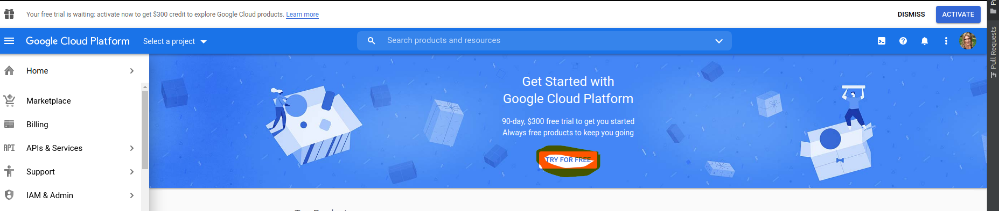
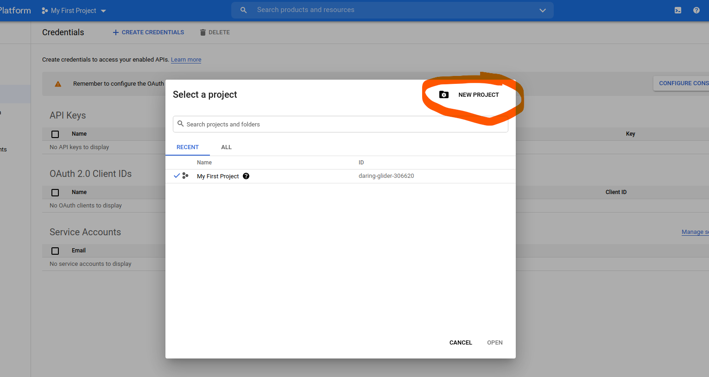
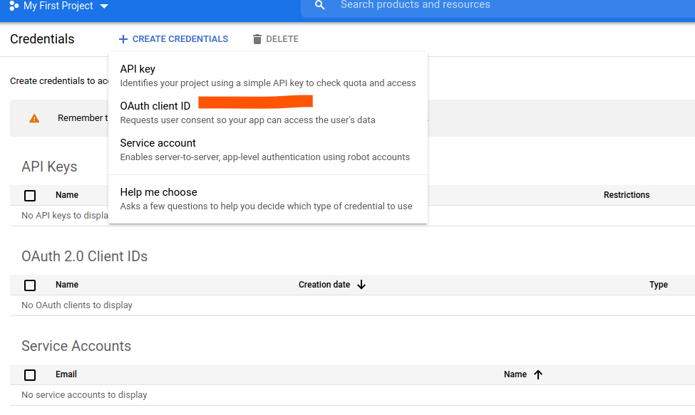
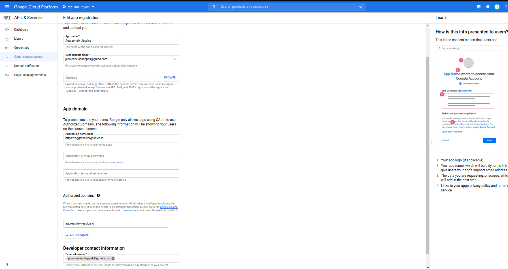
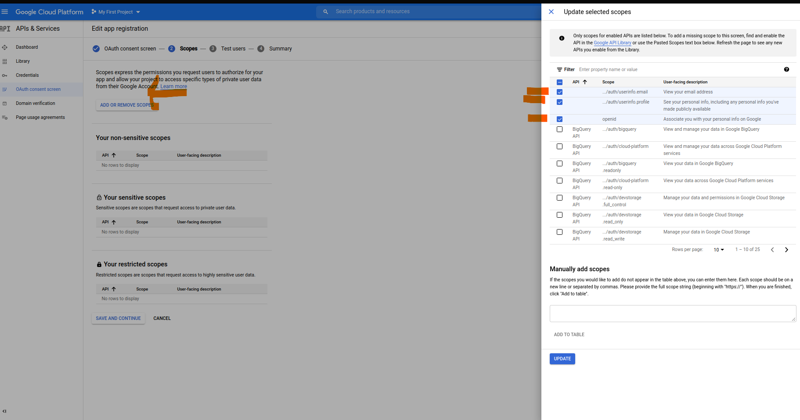
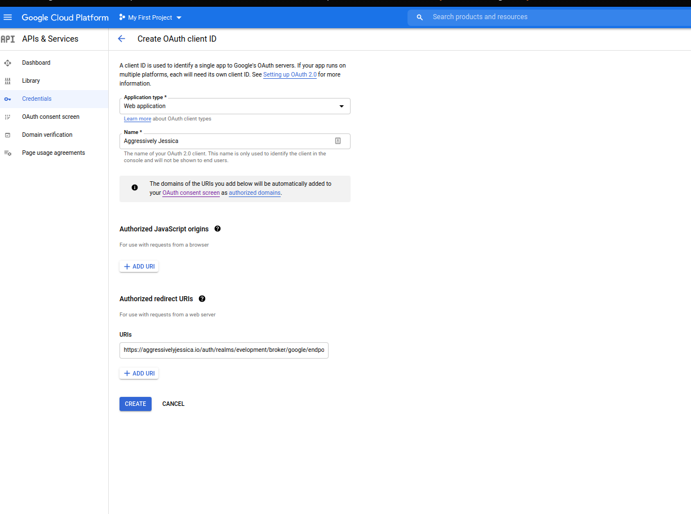
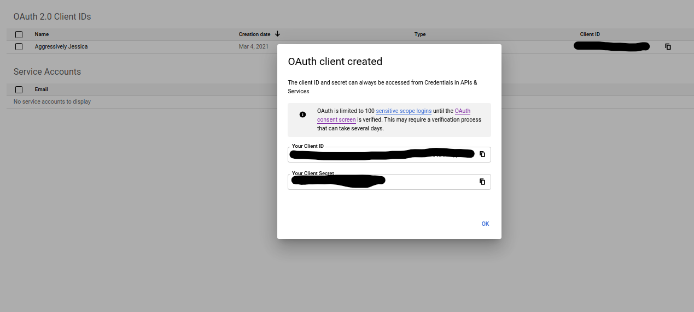

# Sample EKS Deployment with Keycloak and Kong
## Prerequisites
    - Docker
    - AWS
    - Route53 Registered Domain Name
    - Kong OIDC Image Built and pushed to Dockerhub or ECR
    - Google Cloud OAuth2.0 application registered

## Components
### - Keycloak:
#### What is Keycloak?:
https://www.keycloak.org/documentation

https://github.com/keycloak/keycloak-containers/blob/12.0.3/server/README.md

Keycloak is an Open Source Identity and Access Management application that is sponsored by Redhat.  It is designed to implement out of the box Identity Brokering and Single Sign On with Open ID Connect(OIDC), OAUTH 2.0, and SAML 2.0 for any application.  Keycloak has a wide variety of open source libraries built to help a wide variety of resource servers integrate seamlessly.
#### Why Keycloak?:
I chose keycloak because of it's out of the box easy configuration for Identity and Access Management for cloud applications, with minimal additional setup needed, as well as it being opensource with a large user base.
### OIDC Plugin:
#### What is OIDC?:
https://openid.net/connect/

OIDC is an identity layer that's built on top of the OAuth2.0 protocol.  It allows Clients(your API) to verify the
the identity of the end-user based on the authentication performed by the authorization server.  It allows allows you to obtain
basic profile information about the end-user in a REST-like manner making it easier and more secure to integrate with your APIs than
the basic OAuth2.0 protocol.
### - Kong API Gateway:
#### What is Kong?:
Kong is a scalable, open source API Gateway that runs in front of any RESTful API and is extended through plugins which can provide extra functionality.
#### Kong Features:
- extends horizontally
- can operate on any infrastructure on premise or cloud
- it's modular, meaning you can extend it's functionality with user written or community plugins
#### Kong Ingress Controller:
a controller is a manager or watcher of a type of resources in kubernetes.  It watches the kubernetes API and executes tasks based upon defined set of labels or annotations on deployed resources.

Deploy certificates automagically to Ingress Resources with the LetsEncrypt Cluster issuer and Cert-Manager deployments

Accepts Custom defined plugins and Kong images

### - EKS:
#### What is EKS?:
https://docs.aws.amazon.com/eks/latest/userguide/what-is-eks.html

EKS is AWS's hosted Kubernetes solution, it simplifies the management and integration of Kubernetes with your AWS services, and operates in the same manner as most other hosted Kubernetes distros
### - LetsEncrypt:
#### What is LetsEncrypt?:
https://letsencrypt.org/how-it-works/

LetsEncrypt is A nonprofit Certificate Authority providing TLS certificates to 240 million websites.  It is free for use and easy to configure, and integrate with your applications.  Default certificate length is 90 days.
When running on Kubernetes, the cert-manager service automagically renews and redeploys the certificates when they are within 30 days of expiration.

We use DNS01 Auth for LetsEncrypt in this instance.  DNS01 Auth ensures that you validate control of the domain you're issuing a certificate for by inserting a specific TXT
record under that domain name.  This also allows you to issue wildcard certificates.
### - Google Cloud OAuth2.0 application:
#### What is the Google Cloud OAuth2.0 Application?:
This is required to enable an Identity Broker for the OIDC workflow in Keycloak to secure your application.
#### Configuring OAuth2.0 Client
- Step 1
- Step 2
- Step 3
- Step 4
- Step 5
- Step 6
- Step 7

###Configuring Keycloak Realm and Client:
#### Not Done Yet

### Building the Kong-OIDC Docker Image
Clone https://github.com/jessicuzwhynot/kong-oidc locally.  Open the Repository and run: `docker build . -t <image-tag>`
After the image builds.  Push the image to your docker repository and update the .env file with the correct image tag.  You can also use: `jimbojangles/kong-oidc:2.3.2`
The referenced image is built on top of Kong 2.3.2 with the OIDC plugin and dependencies installed.

### Manual Steps:
- Setup Keycloak
- Configure Client, Realm, IDP